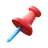
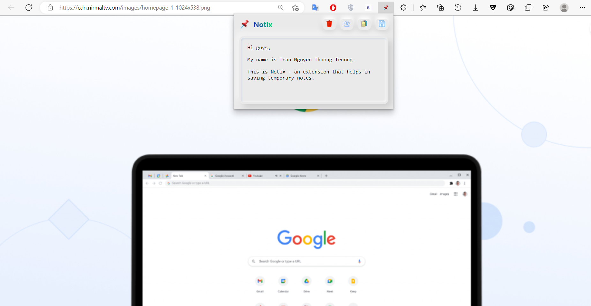
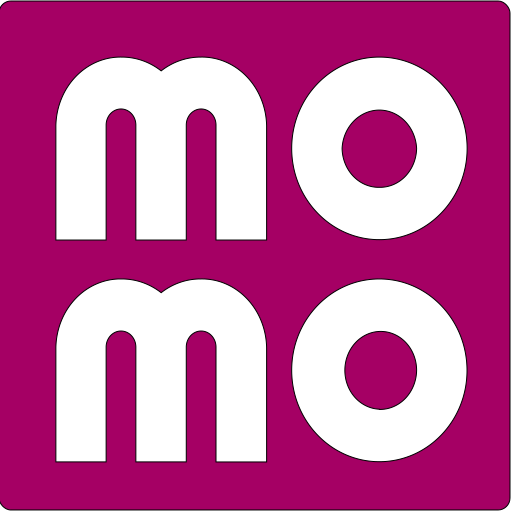

<div align="center">
  
  
  

   $\huge\textcolor{purple}{\text{Notix}}$

  $\small\textcolor{purple}{\textit{Saving temporary notes extension}}$
</div>



## 📢 $\textcolor{purple}{\text{About}}$

* Notix is a simple extension that helps in saving temporary notes. It is built with HTML, CSS and JavaScript. It is cross-browser and can be used in any browser that supports extensions.

## 🎉 $\textcolor{purple}{\text{Features}}$

##### (not support in <ins>http://localhost</ins>)

-   Create, edit, delete and save notes
-   Copy notes to clipboard
-   Export and download notes as .txt files
-   Cross-browser
-   UI/UX friendly (transition button list, shadow effect, gradient title etc.)

## 🎯 $\textcolor{purple}{\text{Todo}}$

-   [ ] Add dark mode
-   [ ] Update UI

## 🧩 $\textcolor{purple}{\text{Built With}}$

-   [HTML](https://www.w3schools.com/html/)
-   [CSS](https://www.w3schools.com/css/)
-   [JavaScript](https://www.w3schools.com/js/)
-   [Manifest](https://developer.chrome.com/docs/extensions/mv3/manifest/)

## 🔨 $\textcolor{purple}{\text{Development}}$

- Star this repository

- Clone the repository

```bash
git clone https://github.com/thuongtruong1009/notix.git
```

-   **Open any browser** -> **Settings** -> **Extensions** -> **Click developer mode (open $\textcolor{blue}{\text{chrome://extensions/}}$ for chrome)** -> **Load unpacked** -> **Select the cloned folder**

## 🛡️ $\textcolor{purple}{\text{License}}$

This project is licensed under the MIT License - see the [LICENSE](LICENSE) file for details
Copyright of [@thuongtruong1009](https://github.com/thuongtruong1009), 2023

## ❤️ $\textcolor{purple}{\text{Support me}}$

> <a href="https://nhantien.momo.vn/0917085937"></a>
<a href="https://www.paypal.me/thuongtruong1009"></a>
<a href='https://ko-fi.com/thuongtruong1009'></a>
<a href="public/mb_qr.jpg"></a>
