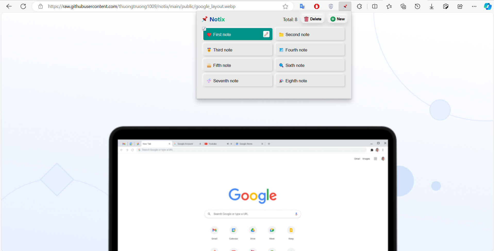

<div align="center">
  
  
  
  

 $\huge\textcolor{purple}{\text{Notix}}$

$\small\textcolor{purple}{\textit{Saving temporary notes extension}}$

</div>



## 📢 About

-   Notix is a simple extension that helps in saving temporary notes. It is built with HTML, CSS and JavaScript. It is cross-browser and can be used in any browser that supports extensions.

## 🎉 Features

##### (Not support in <ins>http://localhost</ins> static living)

-   Create, edit, delete and save notes
-   Copy notes to clipboard
-   Download notes as .txt files
-   Auto save typed notes
-   Cross-browsers
-   UI/UX friendly (transition button list, shadow effect, gradient title etc.)

## 🎯 Todo

-   [ ] Setting options (dark mode, font color, font size, popup size, etc.)

## 🧩 Built With

-   [HTML](https://www.w3schools.com/html/)
-   [CSS](https://www.w3schools.com/css/)
-   [JavaScript](https://www.w3schools.com/js/)
-   [Chrome extension](https://developer.chrome.com)

## 🔨 Development

-   Star this repository

-   Clone the repository

```bash
git clone https://github.com/thuongtruong1009/notix.git
```

-   **On browser** -> **Settings** -> **Extensions** -> **Developer mode (open $\textcolor{blue}{\text{chrome://extensions/}}$ for chrome)** -> **Load unpacked** -> **Select the cloned folder**

## 🛡️ License

This project is licensed under the [MIT LICENSE](LICENSE)

Copyright of [@thuongtruong1009](https://github.com/thuongtruong1009), 2023

## ❤️ Support me

> <a href="https://nhantien.momo.vn/0917085937"></a> <a href="https://www.paypal.me/thuongtruong1009"></a> <a href='https://ko-fi.com/thuongtruong1009'></a> <a href="public/mb_qr.jpg"></a>
